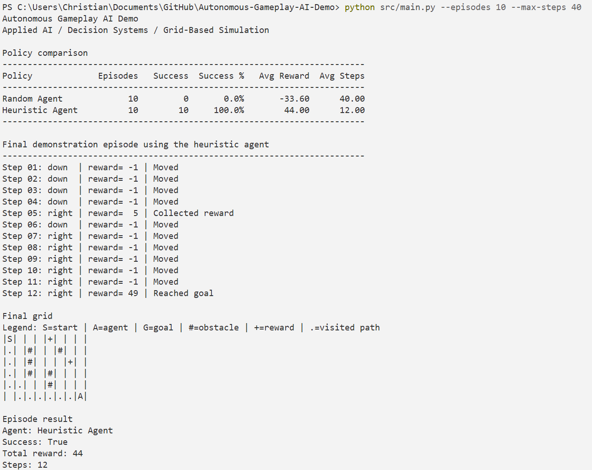

# 🧠 Autonomous Gameplay AI Demo

**Public demo – Applied AI / Decision Systems / Grid-Based Simulation**

This repository contains a small public demo of an autonomous decision-making agent in a simplified grid-based gameplay environment.

The goal is not to build a full game. The goal is to demonstrate how an agent can perceive an environment, choose actions, receive rewards, and be evaluated against a baseline strategy.

---

## 📌 Why this project exists

Applied AI is not only about using large models. It is also about modeling decisions, defining objectives, representing state, evaluating behavior, and improving outcomes.

This demo shows a simple decision system where an agent must:

- observe its position in a grid;
- move toward a goal;
- avoid obstacles;
- collect rewards;
- compare decision policies;
- report performance metrics.

---

## 🎮 Demo concept

The environment is a fictional grid-based gameplay scenario.

The agent starts at one position and must reach a target while avoiding blocked cells. Each step has a small cost. Reaching the goal gives a positive reward. Hitting obstacles or wasting too many steps reduces performance.

Two policies are included:

| Policy | Description |
|---|---|
| Random Agent | Chooses actions randomly and acts as a baseline |
| Heuristic Agent | Chooses actions that tend to reduce the distance to the goal while avoiding invalid moves |

---

## 🖼️ Screenshot

### Terminal simulation output



---

## 🧪 What it demonstrates

This project demonstrates:

- environment modeling;
- state representation;
- reward design;
- policy comparison;
- simulation loops;
- performance metrics;
- decision-making logic;
- AI-oriented product thinking.

---

## 📂 Repository structure

```text
.
├── src/
│   ├── main.py              # Entry point
│   ├── environment.py       # Grid world and reward rules
│   ├── agent.py             # Random and heuristic agents
│   ├── simulation.py        # Episode runner and metrics
│   └── visualization.py     # Terminal grid rendering
├── docs/
│   └── decision-model.md
├── screenshots/
│   ├── .gitkeep
│   └── terminal_demo.png
├── requirements.txt
└── README.md
```

---

## 🚀 How to run

This demo uses only the Python standard library.

```bash
python src/main.py
```

Optional arguments:

```bash
python src/main.py --episodes 10 --max-steps 40
```

---

## 📊 Example output

The simulation prints:

- final grid state;
- episode-by-episode results;
- total reward;
- steps used;
- success rate;
- comparison between random and heuristic behavior.

---

## 💼 Professional relevance

This project connects **game systems**, **decision logic**, and **Applied AI**.

It is intentionally small, but it demonstrates the same foundational thinking used in larger AI systems: define the environment, model available actions, create an objective, run simulations, compare behaviors, and iterate.

---

## 🔒 Scope notice

This is a public learning and portfolio project. It does not use proprietary assets, private datasets, external APIs, or confidential logic.
